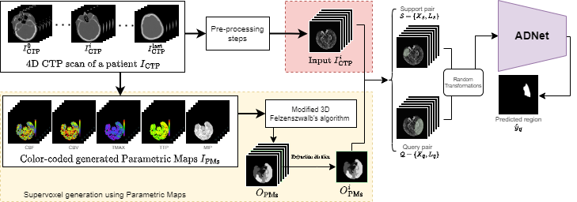

# ADNet
Code for the paper ["Self-Supervised Few-Shot Learning for Ischemic Stroke Lesion Segmentation"](), accepted for the ISBI 2023 conference.



#### Abstract
Precise ischemic lesion segmentation plays an essential role in improving diagnosis and treatment planning for ischemic stroke, one of the prevalent diseases with the highest mortality rate.
While numerous deep neural network approaches have recently been proposed to tackle this problem, these methods require large amounts of annotated regions during training, which can be impractical in the medical domain where annotated data is scarce.
As a remedy, we present a prototypical few-shot segmentation approach for ischemic lesion segmentation using only one annotated sample during training.
The proposed approach leverages a novel self-supervised training mechanism that is tailored to the task of ischemic stroke lesion segmentation by exploiting color-coded parametric maps generated from Computed Tomography Perfusion scans. 
We illustrate the benefits of our proposed training mechanism, leading to considerable improvements in performance in the few-shot setting.
Given a single annotated patient, an average Dice score of 0.58 is achieved for the segmentation of ischemic lesions.

```
@article{TBA}
```

# Getting started
### Requirements
Requirements are included in the Dockerfile.

### Data sets and pre-processing
Download:
1) [Combined Healthy Abdominal Organ Segmentation data set](https://chaos.grand-challenge.org/)
2) [Multi-sequence Cardiac MRI Segmentation data set](https://zmiclab.github.io/projects/mscmrseg19/) (bSSFP fold)

Pre-processing is performed according to [Ouyang et al.](https://github.com/cheng-01037/Self-supervised-Fewshot-Medical-Image-Segmentation/tree/2f2a22b74890cb9ad5e56ac234ea02b9f1c7a535) and we follow the procedure on their github repository.

### Training
1. Compile `./supervoxels/felzenszwalb_3d_cy.pyx` with cython (`python ./supervoxels/setup.py build_ext --inplace`) and run `./supervoxels/generate_supervoxels.py` 
2. Download pretrained 3D ResNeXt weights from `<insert link>` (for 3D version) 
3. Run `./script/train_<abd, cmr>_<2D, 3D>.sh` 

### Inference
Run `./script/test_<abd, cmr>_<2D, 3D>.sh` 
